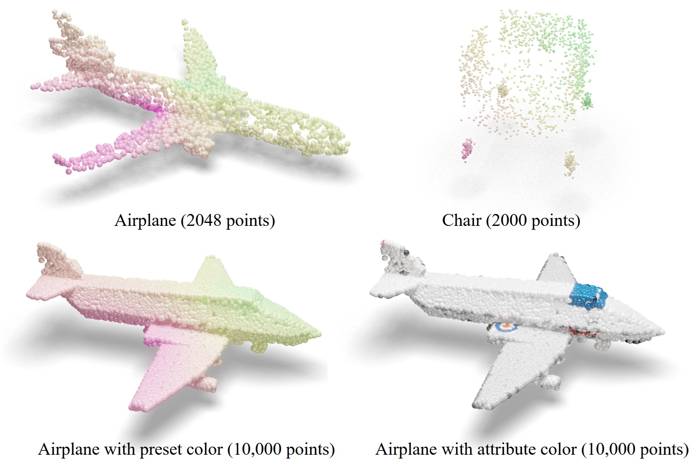
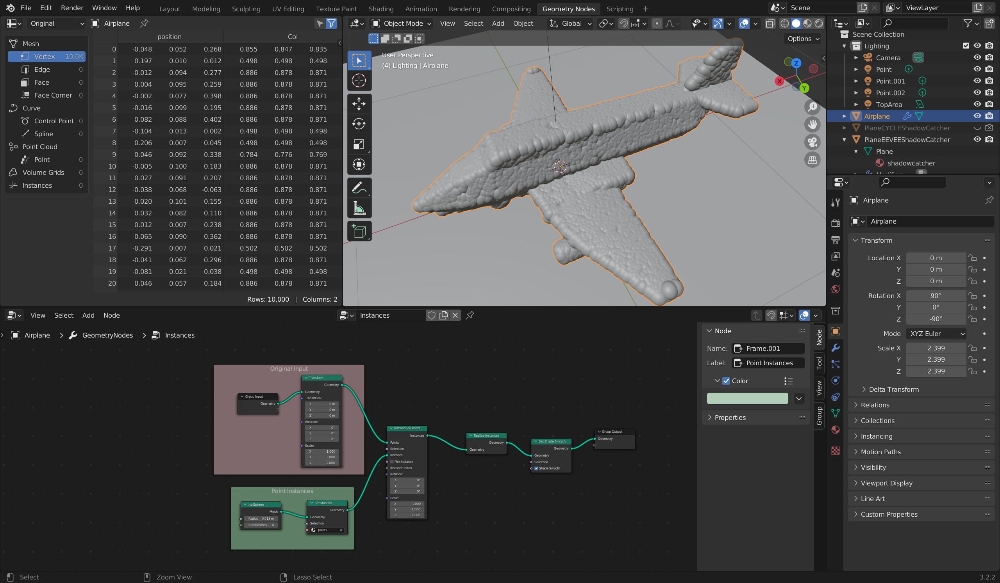
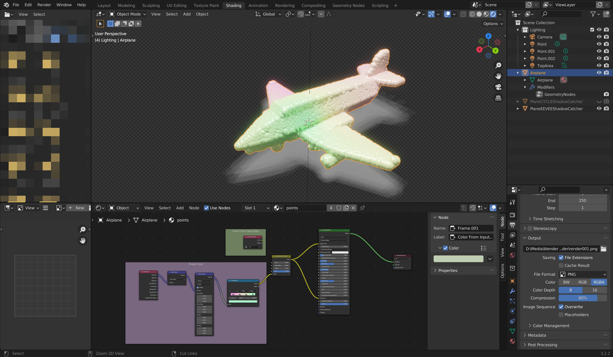
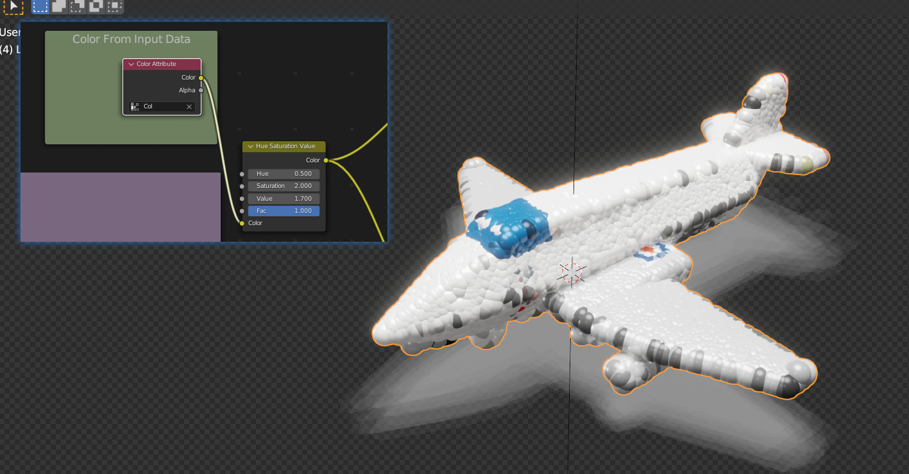
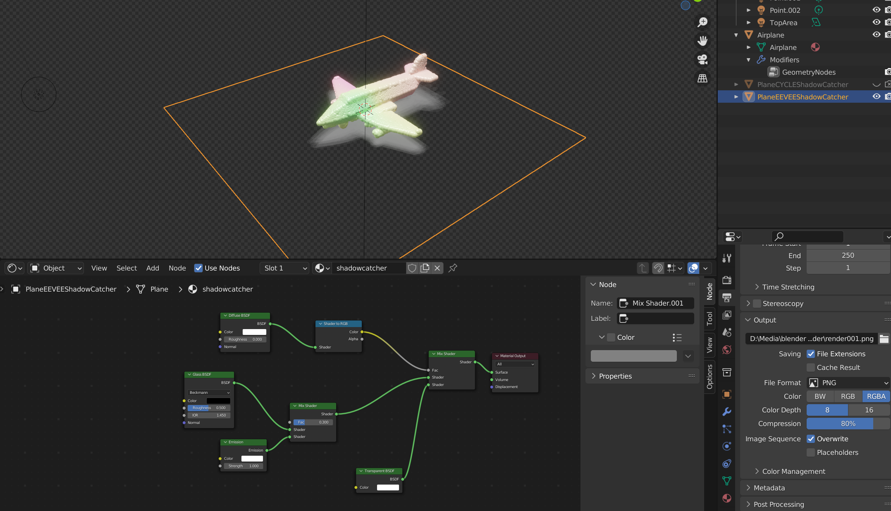
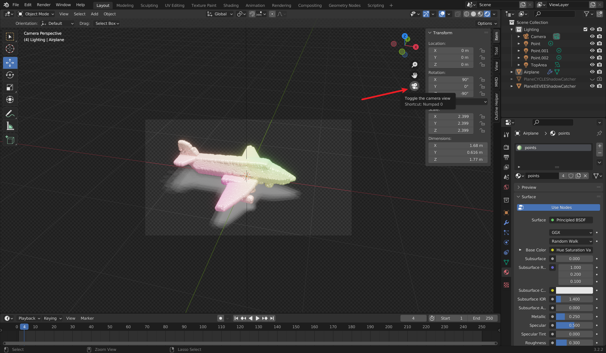
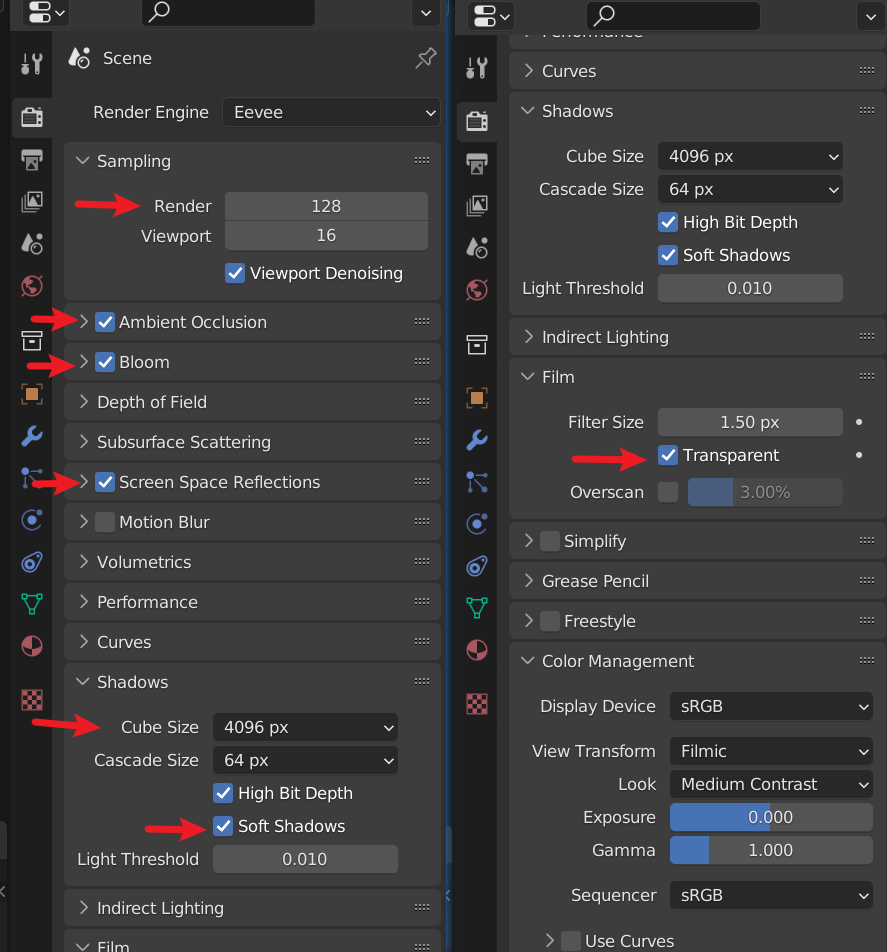
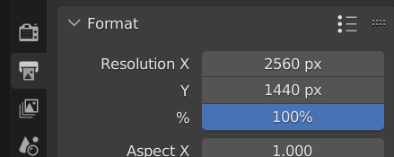
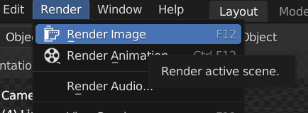

# Blender Preset for Point Cloud Rendering

 A simple and convenient Blender EEVEE preset for the rendering of point clouds suitable for academic papers.

### Previously

In my previous repo, [QifHE/3D-Point-Cloud-Rendering-with-Mitsuba (github.com)](https://github.com/QifHE/3D-Point-Cloud-Rendering-with-Mitsuba) provides a method to render point clouds by [Mitsuba](https://github.com/mitsuba-renderer/mitsuba2), however, it is inconveniet to adjust the point cloud objects, since the parameters can only be set in the XML configuration file, and it cannot output images with a transparent background. Therefore, this repo aims to develop an alternative method based on the very popular Blender, so people can directly view the shading results in the software and modify the parameters in real time according to their needs.

### How To Use

Only limited file formats can be imported into Blender, so please convert your point cloud files into `.ply` extension at first, whose method can be easily found online or by asking ChatGPT.

This is a Blender preset so you can either open it directly then replace the mesh object named `Airplane` inside, or append the following in the `PointCloudRenderPreset.blend` file into your Blender project.

- `Material/points`
- `Material/shadowcatcher`
- `NodeTree/instances`
- `Collection/Lighting`

Firstly, you go to the `Geometry Nodes` tab on the top. Select your point cloud object in the view, then go to the NodeTree editor in the below, and assign the object with the `instances` nodetree. This transforms your vertices into ball mesh instances. In the `Transform` node, you can adjust your object to proper position and scale. In `Ico Sphere` node, you can change the radius of balls. Note that the material in the `Set Material` node should be assigned to `points`.

Then go to the `Shading` tab on the top, and select your object and assign it with the preset's `points` material. On the top right corner, switch your current view to `Viewport Shading`, then you can see the shading result. You can change the color in the `ColorRamp` node, and if your `.ply` file has stored color in the vertices' `Col` attribute, you can reconnect `ColorAttribute` node with the `Hue Saturation Value` node.

If you used the appending method, remeber to add a plane on the ground, and assign it with the preset's `shadowcatcher` material. It shows some white shadow by the transparent background in order to reduce the intensity of the black shadow, and it will look fine by a white background, especially in the acdemic papers.

Finally, go back to `Layout` and toggle the camera view on the right to see that if the camera position is set properly. Then go to the  `Render Properties `, make sure that the render engine is `Eevee`. Increase the sampling amount of Render if you like. Enable `Ambient Occlusion, Bloom, Screen Space Reflections `. In the `film `tab, enable `Transparent`. In the  `Shadows` tab, increase the `cube size `to `4096px` and enable `Soft Shadows`. After that, go to the `Output Properties`, change the `resolution` as you like, and make sure the output is in `PNG` format.

After all the steps above, go to the `Render` tab and `Render Image`. Then you are done!

### To Do

Scripts that batch load and render point clouds by Blender.

### Acknowledgement

- [TombstoneTumbleweedArt/import-ply-as-verts: New Blender 3.0* / 3.1 PLY importer v2.0 for point clouds and nonstandard models. (github.com)](https://github.com/TombstoneTumbleweedArt/import-ply-as-verts) Thank them for the method to convert `.ply` vertices into point instances.
- [Blender Shadow Catcher - Enable Shadow Catcher in both EEVEE &amp; Cycles - YouTube](https://www.youtube.com/watch?v=xFi_88TIQgc) Thank them for the method to create a workaround for the shadow catcher in the EEVEE engine.
